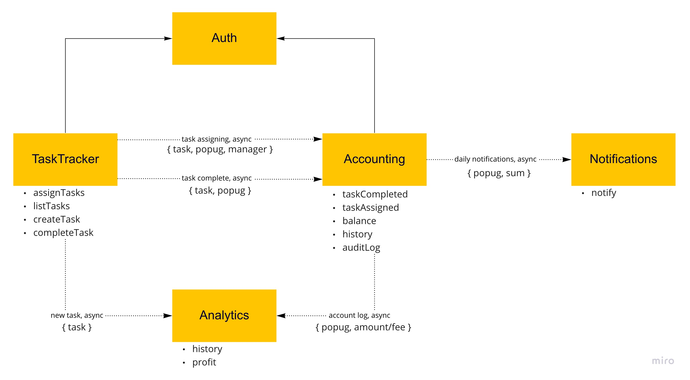

# ates
Awesome Task Exchange System (aTES)

  
Flow Chart v1.0

## Flow chart

### Сервисы
Выбор сервисов естественно пришел из требований.

### Проблемы и отказоустойчивость
- На данный момент отказоустойчивость обеспечивается благодаря использованию брокеров сообщений при коммуникации между сервисами.
- Приложение должно работать до тех пор, пока сам сервис, его база и брокер доступны. Если зависимый сервис упадет, данные не должны потеряться.

### Спорные моменты
- Сейчас модуль Аналитики частично дублирует данные Аккаунтинга. Неочевиден учет переходящего отрицательного баланса.
- Создание новых пользователей не отображено на схеме

## Event Storming

## Data Model

## Domain Model

## Communication
*Note, login itself is out of scope.*

## Events  

